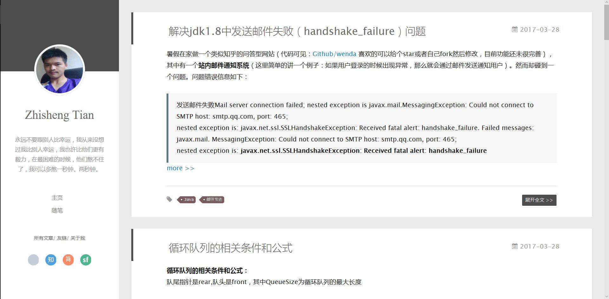
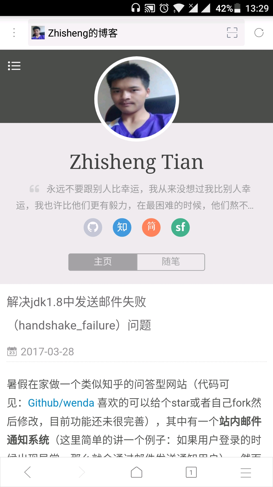

## 博客

测试站点：[www.54tianzhisheng.cn](http://www.54tianzhisheng.cn/)


**更新于 2019-03-18**


换了个新版本的主题，基于 yilia 主题修改的！

标签页面变成这样了：


代码加入了简单的高亮：


---

本博客使用 Github Page + Hexo 搭建的，主题采用的是 [**yilia**](https://github.com/litten/hexo-theme-yilia) ，在此感谢作者 [litten](https://github.com/litten) 。

博客网页界面：



手机端界面：




***

### 主题使用

#### 安装：

```
$ git clone https://github.com/litten/hexo-theme-yilia.git themes/yilia
```

#### 配置

修改hexo根目录下的 `_config.yml` ： `theme: yilia`

#### 更新

```
cd themes/yilia
git pull
```

## 配置

主题配置文件在主目录下的`_config.yml`，请根据自己需要修改使用。

```
# Header

menu:
  主页: /
  随笔: /tags/随笔/

# SubNav
subnav:
  github: "https://github.com/zhisheng17/"
  #weibo: "#"
  zhihu: "https://www.zhihu.com/people/tian-zhisheng/activities"
  #qq: "#"
  #weixin: "#"
  jianshu: "http://www.jianshu.com/u/419f65c24433"
  #douban: "#"
  segmentfault: "https://segmentfault.com/u/yuanblog"
  #bilibili: "#"
  #acfun: "#"
  #mail: "zhisheng2018@gmail.com"
  #rss: "atom.xml"
  #facebook: "#"
  #google: "#"
  #twitter: "#"
  #linkedin: "#"

rss: /atom.xml

# 是否需要修改 root 路径
# 如果您的网站存放在子目录中，例如 http://yoursite.com/blog，
# 请将您的 url 设为 http://yoursite.com/blog 并把 root 设为 /blog/。
root:

# Content

# 文章太长，截断按钮文字
excerpt_link: more
# 文章卡片右下角常驻链接，不需要请设置为false
show_all_link: '展开全文'
# 数学公式
mathjax: false
# 是否在新窗口打开链接
open_in_new: false

# 打赏
# 请在需要打赏的文章的md文件头部，设置属性reward: true

# 打赏基础设定：0-关闭打赏； 1-文章对应的md文件里有reward:true属性，才有打赏； 2-所有文章均有打赏
reward_type: 2
# 打赏wording
reward_wording: '谢谢你支持我买服务器！'
# 支付宝二维码图片地址，跟你设置头像的方式一样。比如：/assets/img/alipay.jpg
alipay: /img/zhifubao.jpg
# 微信二维码图片地址
weixin: /img/weixin.jpg

# Miscellaneous
baidu_analytics: ''
google_analytics: ''
favicon: /img/favicon.ico

#你的头像url
avatar: /img/avatar.png

#是否开启分享
share_jia: true

#是否开启多说评论，填写你在多说申请的项目名称 duoshuo: duoshuo-key
#若使用disqus，请在博客config文件中填写disqus_shortname，并关闭多说评论
duoshuo: false

# 样式定制 - 一般不需要修改，除非有很强的定制欲望…
style:
  # 头像上面的背景颜色
  header: '#4d4d4d'
  # 右滑板块背景
  slider: 'linear-gradient(200deg,#a0cfe4,#e8c37e)'

# slider的设置
slider:
  # 是否默认展开tags板块
  showTags: false

# 智能菜单
# 如不需要，将该对应项置为false
# 比如
#smart_menu:
#  friends: false
smart_menu:
  innerArchive: '所有文章'
  friends: '友链'
  aboutme: '关于我'

friends:
  廖雪峰: http://www.liaoxuefeng.com/
  阮一峰: http://www.ruanyifeng.com/blog/
  陈皓: http://coolshell.cn/
  闻波: http://www.cnblogs.com/webary/
  冯兆峯: http://blog.csdn.net/zffenger

aboutme: 很惭愧<br><br>只做了一点微小的工作<br>谢谢大家
```

注意：每个标签冒号 `:` 后面需加空格

***

### 更新

2017-06-13   增加文章目录，使用的时候在每篇文章顶部加上 `toc: true` 即可。

参考文章:  [Hexo+yilia主题实现文章目录和添加视频 ](http://lawlite.me/2017/04/17/Hexo-yilia%E4%B8%BB%E9%A2%98%E5%AE%9E%E7%8E%B0%E6%96%87%E7%AB%A0%E7%9B%AE%E5%BD%95%E5%92%8C%E6%B7%BB%E5%8A%A0%E8%A7%86%E9%A2%91/)

***

### 关于 Fork 和 Star

欢迎直接 fork 我的代码，然后在我的基础上改配置文件，这样不容易出错（因为之前自己碰到的坑大多是在这里），如果觉得我的博客文章还不错的话，欢迎点个 star 。谢谢！

***

### 疑问

如果搭建时遇到问题，请加微信：zhisheng_tian